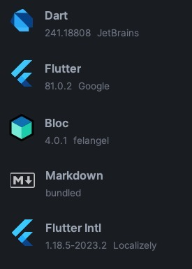

>The full documentation are contained in 5 README.md files
> - This one: `Abstract, Architecture & Setup`
> - lib > data > README.md : `Core, Equatable & Serializable`
> - lib > domain > README.md : `Repositories, Clients & Services`
> - lib > ui > README.md : `Routing, Theme, Translations...`
> - lib > ui > bloc > README.md : `State Management & Dependency Injection`


# Table of Contents

- [Base Structure](#base-structure)
- [Core Dependencies](#core-dependencies)
- [Android Studio Plugins](#android-studio-plugins)
- [Run & Compile](#run--compile)
   - [Environment Variables for Sensitive Data](#environment-variables-for-sensitive-data)
- [Testing](#testing)
- [Dev Dependencies & Assets](#dev-dependencies--assets)
   - [Launcher Icons](#launcher-icons)
   - [Assets](#assets)

## BASE STRUCTURE

```
project_name/ 
├── lib/                    ### MAIN DIRECTORY
│   ├── data/               # Object classes, cannot depend on other directories.
│   │   ├── model/          # Classes that are being used on the UI.
│   │   ├── enum/           # Data classes for types, lists and constants.
│   │   └── dto/            # Clases used only in API exchange.
│   │ 
│   ├── domain/             # Business logic and core functionality, cannot depend on ui.
│   │   ├── client/         # Classes for API clients and network interactions.
│   │   ├── repository/     # Data repositories to manage data sources.
│   │   └── service/        # Service classes for handling business operations.
│   │ 
│   ├── ui/                 # User Interface components.
│   │   ├── bloc/           # State management (Bloc/Cubit for UI state).
│   │   ├── navigation/     # Routing logic, screen constant definitions.
│   │   ├── screen/         # UI main components, not reusable.
│   │   ├── theme/          # Styling and Translation configurations.
│   │   └── widget/         # Reusable components.
│   │ 
│   └── util/               # Helper classes, functions, and extensions.
│   
├── assets/                 # Static assets such as images, fonts...
│ 
│                           ### PLATFORM SPECIFIC CODE
├── android/                # Autogen. permissions in `app > src > main > AndroidManifest.xml`.
├── ios/                    # Autogen.
├── macos/                  # Autogen.
├── linux/                  # Autogen.
├── windows/                # Autogen.
├── web/                    # Autogen.
│ 
├── build/                  # Output, compiled code (build results).
├── test/                   # Unit Testing.
├── integration_test/       # UI Testing.
├── analysis_options.yaml   # Linter configuration.
├── build.yaml              # JsonSerializable Configuration or build configuration.
└── pubspec.yaml            # Project configuration and dependencies.
```

## CORE DEPENDENCIES

```bash  
flutter pub add flutter_bloc equatable json_serializable json_annotation build_runner encrypt
```  
```bash
flutter pub add flutter_localizations --sdk=flutter
```
```bash
flutter pub add intl:any
```

In `pubspec.yaml`:

```yaml
dependencies:
  flutter:
    sdk: flutter

  # State Management
  flutter_bloc: ^8.1.6
  equatable: ^2.0.5

  # Network & Serialization
  dio: ^5.5.0+1
  json_annotation: ^4.9.0
  json_serializable: ^6.8.0
  build_runner: ^2.4.9
  encrypt: ^5.0.3

   # Translations
  flutter_localizations:
    sdk: flutter
  intl: any
```

> To configure translations see `lib` > `ui` > `Readme.md`

Get and install dependencies:

```bash  
flutter pub get
```  

Delete output builds and dependencies:

```bash  
flutter clean
```  

Upgrade minor version dependencies

```bash  
flutter pub upgrade
```  

Full upgrade dependencies

```bash  
flutter pub upgrade --major-versions
```

Upgrade Flutter itself

```bash  
flutter upgrade
```

Downgrade Flutter

1. Go to Flutter folder (usually in user home)
    ```bash
    cd ~\.flutter\
    ```
2. It's a git repo, checkout desired version,
   see [Flutter Versions](https://docs.flutter.dev/release/archive)
    ```bash
    git checkout tags/3.10.5
    ```
3. Install current git version and validate flutter configuration
    ```bash
    flutter doctor
    ```
   
Generate Json Methods
```bash
dart run build_runner build
```

> To configure serialization see `lib` > `data` > `Readme.md`


## ANDROID STUDIO PLUGINS

<table>
  <tr>
    <td>
      
    </td>
    <td style="vertical-align: middle;">
      <ul style="list-style-type: none; padding: 0;">
        <li style="margin: 48px 0;">Dart</li>
        <li style="margin: 48px 0;">Flutter</li>
        <li style="margin: 48px 0;">Bloc</li>
        <li style="margin: 48px 0;">Markdown</li>
        <li style="margin: 48px 0;">Flutter Intl</li>
      </ul>
    </td>
  </tr>
</table>

> If there is any issues to display the markdown files in AndroidStudio check
> this: [Java Runtime with JCEF](https://stackoverflow.com/questions/53903641/where-is-android-studio-markdown-support-plugin-preview-preference)

## RUN & COMPILE

### ENVIRONMENT VARIABLES FOR SENSITIVE DATA

In `data` > `models` > `environment.dart`

```dart
/// Provides Env Variables.
class Environment {
  final String baseUrl;
  final String secretKey;

  // Private constructor, so the class cannot be instantiated externally
  const Environment._({required this.baseUrl, required this.secretKey});

  // ⚠ Never hardcode real data in defaultValue.
  static Environment getEnvCredentials() {
    const baseUrl = String.fromEnvironment('PROJECT_URL', defaultValue: 'DEFAULT URL');
    const secretKey = String.fromEnvironment('PROJECT_KEY', defaultValue: 'DEFAULT KEY');

    return const Environment._(baseUrl: baseUrl, secretKey: secretKey);
  }
}
```

The project can be run from terminal or the IDE, here is how to config the variables on each case:

1. **From ANDROID STUDIO** (Recommended for Development):
    - Edit or create a new config with the env variables in the `Additional Run Args`
        
   > You can store you configuration as a file (sometimes IDE updates can delete the current
   configs) ⚠ If you store it make sure the extension `*.run.xml` is included on the gitignore.

2. **From COMMAND LINE** (Recommended for Production & CI/CD)
    - Use the same args for flutter `run` or `build`
   ```bash
   flutter run --dart-define=PROJECT_URL=https://development/api --dart-define=PROJECT_KEY=secret123
   ```
   - From terminal also we can use the SO environment variables 
   ```bash
   flutter run --dart-define=PROJECT_URL=$SO_ENV_URL --dart-define=PROJECT_KEY=$SO_ENV_KEY
   ```


### Testing

Launch Unit Tests

```bash  
flutter test
```  

Launch Integration Tests

```bash  
flutter test integration_test
```  

## DEV DEPENDENCIES & ASSETS

### Launcher Icons

Docs: [Flutter Launcher Icons](https://pub.dev/packages/flutter_launcher_icons).

> Add dev_dependency and configuration in `pubspec.yaml`

```yaml
dev_dependencies:
  flutter_test:
    sdk: flutter
  integration_test:
    sdk: flutter
  flutter_lints: ^2.0.0
  flutter_launcher_icons: ^0.13.1

flutter_launcher_icons:
  android: "launcher_icon"
  ios: true
  image_path: "assets/images/icon/launcher_icon.png"
  min_sdk_android: 21
```

Then build with command:

```bash
dart run flutter_launcher_icons
```

### Assets

At the end of our pubspec.yaml we need to declare the folders that we are using

```yaml
flutter:
  uses-material-design: true
  generate: true
  assets:
      - assets/images/icons/
      - assets/images/readme/
```
So anywhere in the code we can call the images with a relative url:

```dart
final decoration = BoxDecoration(
   image: DecorationImage(
      image: Image.asset('assets/images/readme/readme.plugins.jpg',).image,
   ),
);

final Container container =  Container(decoration: decoration);
```
